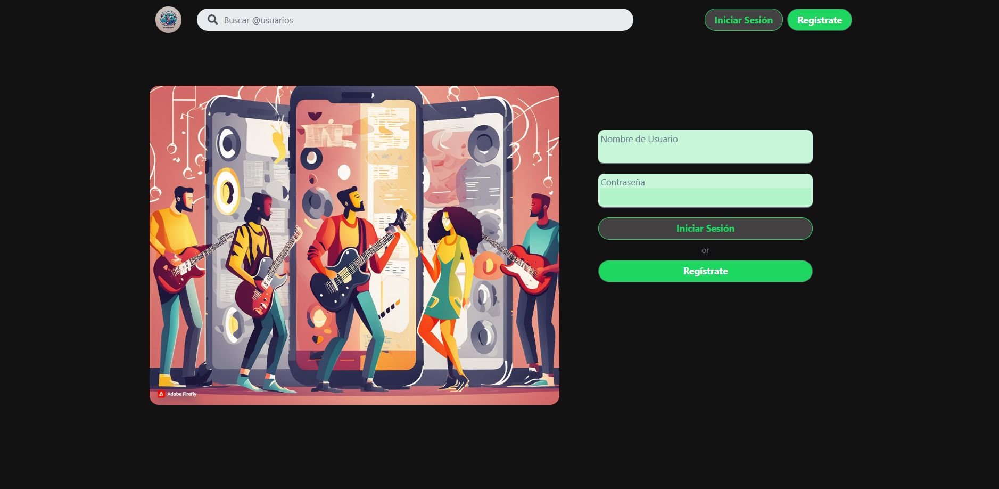
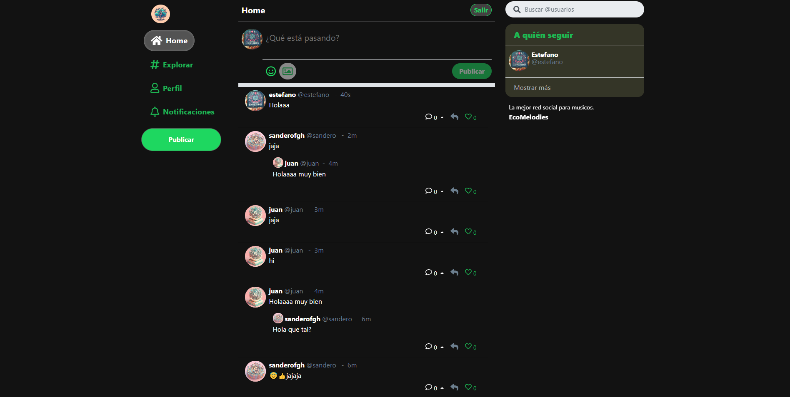

# EcoMelodies
### Tu Red Social Musical en React

Descubre ecomelodies, una innovadora red social para amantes de la música, diseñada para ser ligera, 
rápida y rica en funcionalidades. Explora, comparte y conecta con otros melómanos. Gestiona tu experiencia
musical con una eficiente gestión de estado usando redux-toolkit, autenticación segura con passport, y búsquedas
rápidas de contenido musical con MongoDB. Recibe notificaciones push sobre las últimas interacciones, tendencias 
musicales en tiempo real, y sugerencias de nuevos artistas. Disfruta de una interfaz estilizada con bootstrap, modo
oscuro y emojis para expresarte mejor. Despliega fácilmente configurando `REACT_APP_PUBLIC_VAPID_KEY` y 
`REACT_APP_API_SERVER`. Prueba ecomelodies [aquí]() y encuentra más detalles en 
el [repositorio del back-end](). ¡Únete a la sinfonía y contribuye 
al ritmo de la comunidad! 💥
